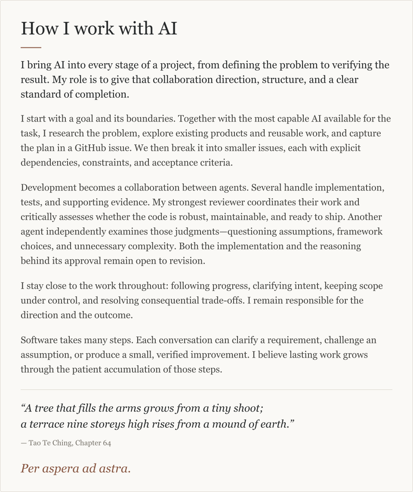
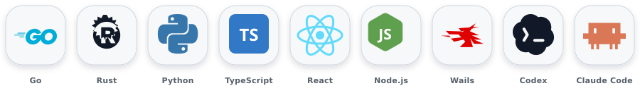
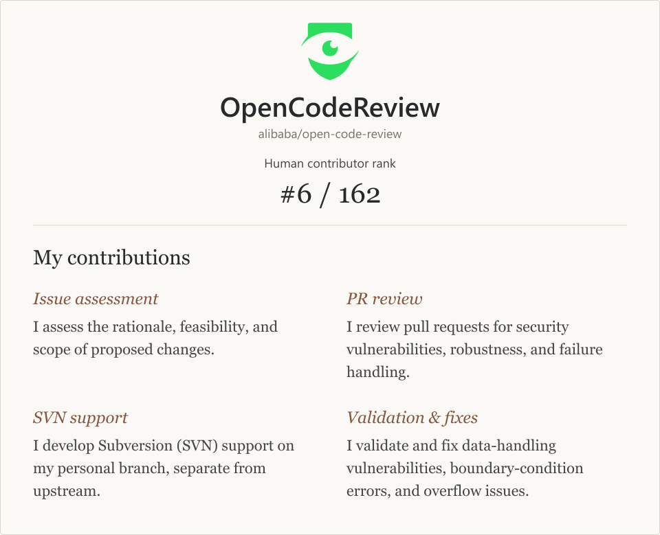

  

  

<h1 align="center">祈愿 Qiii</h1>

  Cybersecurity student based in Sichuan, China. 
  I build local-first agent systems, reliability tooling, and open-source fixes that are auditable, testable, and maintainable.

📊 <strong>At a Glance</strong>

  
  
  

📬 <strong>Connect</strong>

  
  
  
  

🤖 <strong>LLM Toolchain</strong>

  

---

  <picture>
    <source media="(max-width: 600px) and (prefers-color-scheme: dark)" srcset="./assets/ai-philosophy-mobile-dark.svg" />
    <source media="(max-width: 600px)" srcset="./assets/ai-philosophy-mobile-light.svg" />
    <source media="(prefers-color-scheme: dark)" srcset="./assets/ai-philosophy-dark.svg" />
    
  </picture>

Read as text

<!--START_SECTION:ai-philosophy-text-->
## How I work with AI

I bring AI into every stage of a project, from defining the problem to verifying the result. My role is to give that collaboration direction, structure, and a clear standard of completion.

I start with a goal and its boundaries. Together with the most capable AI available for the task, I research the problem, explore existing products and reusable work, and capture the plan in a GitHub issue. We then break it into smaller issues, each with explicit dependencies, constraints, and acceptance criteria.

Development becomes a collaboration between agents. Several handle implementation, tests, and supporting evidence. My strongest reviewer coordinates their work and critically assesses whether the code is robust, maintainable, and ready to ship. Another agent independently examines those judgments—questioning assumptions, framework choices, and unnecessary complexity. Both the implementation and the reasoning behind its approval remain open to revision.

I stay close to the work throughout: following progress, clarifying intent, keeping scope under control, and resolving consequential trade-offs. I remain responsible for the direction and the outcome.

Software takes many steps. Each conversation can clarify a requirement, challenge an assumption, or produce a small, verified improvement. I believe lasting work grows through the patient accumulation of those steps.

> “A tree that fills the arms grows from a tiny shoot;
> a terrace nine storeys high rises from a mound of earth.”
>
> — *Tao Te Ching*, Chapter 64

*Per aspera ad astra.*
<!--END_SECTION:ai-philosophy-text-->

## Tech Stack

  

  <strong>Languages</strong> · Go · Rust · Python · TypeScript &nbsp;│&nbsp; <strong>App Development</strong> · React · Node.js · Wails &nbsp;│&nbsp; <strong>AI Coding</strong> · Codex · Claude Code

## Find me in open source

You can find me in the following open-source community.

  <a href="https://github.com/alibaba/open-code-review">
    <picture>
      <source media="(max-width: 600px) and (prefers-color-scheme: dark)" srcset="./assets/community-open-code-review-mobile-dark.svg" />
      <source media="(max-width: 600px)" srcset="./assets/community-open-code-review-mobile-light.svg" />
      <source media="(prefers-color-scheme: dark)" srcset="./assets/community-open-code-review-dark.svg" />
      
    </picture>
  </a>

Read my contributions as text

<!--START_SECTION:community-text-->
### [OpenCodeReview](https://github.com/alibaba/open-code-review)

**Human contributor rank: #6 / 162**

My contributions:

- **Issue assessment.** I assess the rationale, feasibility, and scope of proposed changes.
- **PR review.** I review pull requests for security vulnerabilities, robustness, and failure handling.
- **SVN support.** I develop Subversion (SVN) support on my personal branch, separate from upstream.
- **Validation & fixes.** I validate and fix data-handling vulnerabilities, boundary-condition errors, and overflow issues.
<!--END_SECTION:community-text-->

Snapshot: 8 September 2026. Rank excludes bot accounts; 162 is GitHub's displayed contributor total, not a human-only count. [Contributors](https://github.com/alibaba/open-code-review/graphs/contributors) · [My pull requests](https://github.com/alibaba/open-code-review/pulls?q=is%3Apr+author%3AQiyuanqiii)

## GitHub Activity

  

  
  

  

  

  

  

  <picture>
    <source media="(prefers-color-scheme: dark)" srcset="https://raw.githubusercontent.com/Qiyuanqiii/Qiyuanqiii/output/github-contribution-grid-snake-dark.svg" />
    <source media="(prefers-color-scheme: light)" srcset="https://raw.githubusercontent.com/Qiyuanqiii/Qiyuanqiii/output/github-contribution-grid-snake.svg" />
    
  </picture>

  
<strong>🔧 About this profile</strong>

   

  The streak, trophy, contribution calendar, and snake animations on this page are regenerated automatically by [GitHub Actions](./.github/workflows) and committed back to this repository. Only the [README](./README.md) and the [assets](./assets) are hand-maintained.

  Build the system. Verify the boundary. Ship the fix.

  

